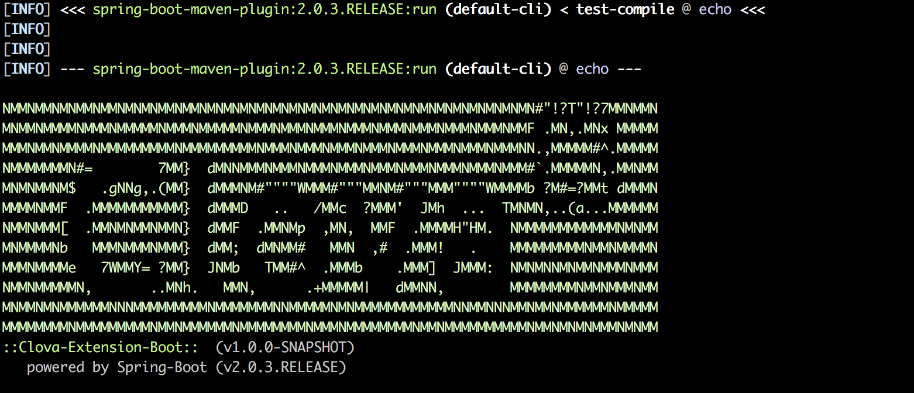

# Clova CEK SDK Java

[](https://travis-ci.org/line/clova-cek-sdk-java)
[](https://maven-badges.herokuapp.com/maven-central/com.linecorp.clova/clova-extension-boot-web)
[](https://javadocio-badges.herokuapp.com/com.linecorp.clova/clova-extension-boot-web)


This repository contains Java libraries for development of Clova extensions using the Clova Extensions Kit(CEK).
  
## How to Develop

[clova-extension-boot-web](clova-extension-boot-web) is a library for development using [Spring Boot](https://spring.io/projects/spring-boot).  
Develop using this library.

### Set Up

#### Project Creation

Create a Spring Boot project to develop a generic web application.  
This can be created easily using [Spring Initializr](https://start.spring.io/).

#### Installation

Install [clova-extension-boot-web](clova-extension-boot-web).
 
#### Installing with Maven

Add as a dependency to `pom.xml` as follows.

```xml
<dependency>
  <groupId>com.linecorp.clova</groupId>
  <artifactId>clova-extension-boot-web</artifactId>
  <version>1.0.0</version>
</dependency>
```

#### Installing with Gradle

Add as a dependency to `build.gradle` as follows.

```groovy
dependencies {
   compile('com.linecorp.clova:clova-extension-boot-web:1.0.0')
}
```

### Develop

Prepare a Handler that handles CEK requests.  
For more information on Handler, see [Sample Extensions](/samples).  
e.g.) `echo`'s [Handler](/samples/echo/src/main/java/com/linecorp/clova/extension/sample/hello/EchoHandler.java)  
No Controller is required.

### Run

```bash
$ ./mvnw spring-boot:run
```



